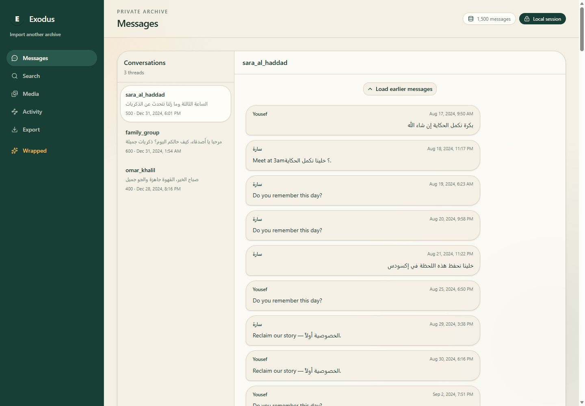

# Exodus

Exodus is a local-first, zero-knowledge explorer for Instagram and WhatsApp data
exports. Drop in a ZIP to search messages, browse media, inspect activity, build
a private Wrapped recap, and export normalized tables. The archive never leaves
the device.

## Interface





The screenshots use the deterministic synthetic fixture; they contain no real
account data.

## Run it

```sh
npm install
npm run fixtures
npm run dev
```

Open `http://localhost:3000`, then drop an export or choose **Try synthetic
export**. The fixture command regenerates deterministic, bilingual demo archives
without using private data.

Other useful scripts: `npm run typecheck`, `npm test`, `npm run build`,
`npm run preview` (static export with CSP headers), `npm run test:browser`
(optional Chromium smoke against the preview server).

For a production build:

```sh
npm run typecheck
npm run test
npm run build
```

The static site is written to `out/`; it has no server component. Run
`npm run preview` to serve that finalized export locally.

## What is supported

- Instagram JSON exports: paginated inbox threads, photos, follower/following
  activity, and Instagram's common Arabic mojibake encoding.
- WhatsApp exports: iOS and Android timestamps, multiline messages, system
  events, omitted media markers, and RTL control marks.
- Local search, lazy media decoding, activity charts, Wrapped analytics, and
  UTF-8 CSV/JSON exports.
- An installable app shell that caches same-origin assets for offline return
  visits.

## Privacy architecture

The page hands the selected `File` to one Comlink-exposed ingest worker.
`@zip.js/zip.js` reads entries on demand there, parser plugins emit zod-validated
normalized rows, and DuckDB-Wasm stores and queries those rows. UI components
can call named queries only; they never parse an archive or contain SQL.

Media files are decompressed lazily when gallery cards approach the viewport.
Their blob URLs are revoked when cards unmount. The Content Security Policy
keeps `connect-src` restricted to the app's own origin, and all WebAssembly,
workers, icons, and demo data are self-hosted.

See [CONTRIBUTING.md](CONTRIBUTING.md) for the three-step parser guide.

## Private samples

Never place a real export in fixtures or documentation. `samples/` is ignored
for local compatibility testing; convert any discovered edge case into a small
synthetic fixture before sharing it.

## License

MIT
